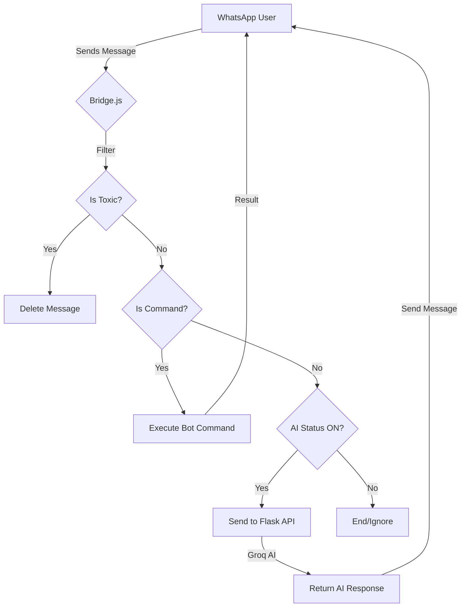

# 🤖 BELINDA_AI

BELINDA_AI is an integrated ecosystem combining a **Flask (Python)** backend and a **Node.js Bridge** to create a powerful, interactive WhatsApp bot. It features AI integration via Groq, educational quizzes, anti-toxic filtering, and automated group management.

---

## 🚀 Key Features
- **AI Brain** (`app.py`): Powered by Flask and Groq API for intelligent conversations.
- **WhatsApp Bridge** (`bridge.js`): High-performance connection using Baileys.
- **Interactive Quiz System**: Automated PG quizzes with discussion features.
- **Anti-Toxic Filter**: Real-time profanity detection and message deletion.
- **Bot Commands**:
  - `!help` → List all available commands.
  - `!quiz [amount] [subject] [level]` → Start an automated quiz.
  - `!next` → Show question discussion (requires 2 users).
  - `!info` → Check AI & Quiz session status.
  - `!bot` → Toggle AI response ON/OFF.
  - `!reset` → Wipe quiz data for the current group.
  - `!lanjut` → Restart the previous quiz settings.
  - `!selesai` → Terminate the quiz session.
  - `!kick {tag/number}` → Remove a member from the group (admin only).
  - `!add {number}` → Add a new member to the group (admin only).
  - `!open` → Allow all members to send messages in the group (admin only).
  - `!close` → Restrict group chat to admins only (admin only).
  - `!zero` → Clear all stored chat history (admin only).
  - `!log` → Show the chat history/logs (available to all members).

---

## 📂 Project Structure
```text
BELINDA_AI/
├── app.py              # Flask server (Logic & AI)
├── handlers.py         # AI Status & Message Handlers
├── bridge.js           # WhatsApp Connection Bridge
├── requirements.txt    # Python dependencies
├── package.json        # Node.js dependencies
├── .env                # Secret configurations
├── .gitignore          # Git exclusion rules
└── README.md           # Documentation

```

---

## 💻 System Requirements

To ensure stability and avoid common connection errors (405/515):

* **Node.js**: `v20.x` (LTS) or `v22.x` (LTS) recommended.
* **Python**: `3.10` or higher.
* **RAM**: Minimum `512MB` (1GB recommended).
* **Network**: Stable connection with IPv4 support.

---

## ⚙️ Configuration (`.env`)

Create a `.env` file in the root directory:

```env
# Flask Settings
GROQ_API_KEY=gsk_your_api_key_here
FLASK_PORT=8000

# Bridge Settings
PYTHON_URL=[http://127.0.0.1:8000](http://127.0.0.1:8000)
SESSION_NAME=auth_info

```

---

## 🏗️ Architecture & Logic Flow

### Data Flow Diagram

### Message Processing Flowchart



---

## ▶️ How to Run

1. **Install Dependencies**:
```bash
pip install -r requirements.txt
npm install

```


2. **Start Flask Backend**:
```bash
python app.py

```


3. **Start WhatsApp Bridge**:
```bash
node bridge.js

```


4. **Link WhatsApp**: Scan the QR Code or use the Pairing Code provided in the terminal.

---

## 🛠️ Troubleshooting

### ❌ Error 405 / 440 (Conflict/Method Not Allowed)

* **Cause**: Outdated session or multiple active connections.
* **Solution**: Delete the `auth_info` folder, logout from "Linked Devices" on your phone, and restart the bridge.

### ❌ Error 515 / 428 (Connection Failure)

* **Cause**: Attempting to request pairing code before the socket is ready.
* **Solution**: Ensure you are using the latest version of Baileys and a stable Node.js LTS version.

### ⚠️ AI Status Out of Sync

* **Cause**: Uninitialized state for a specific group/sender.
* **Solution**: Use `!bot` to toggle the state manually to re-sync the handler.

---

## 🧹 Git Hygiene

* Sensitive files like `.env` and `auth_info/` are automatically ignored.
* **Security Note**: Never share your Groq API Key or session files.

---

*Developed by **Danta** | © 2026 **Studio 234***