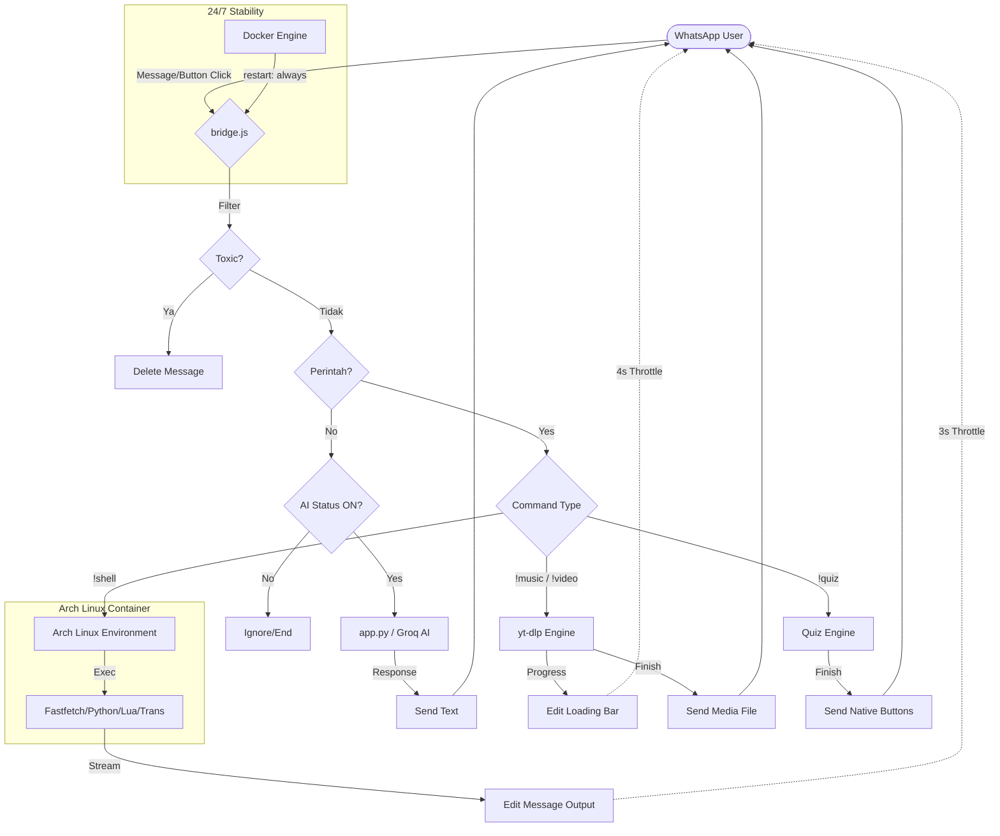

# 🤖 BELINDA_AI - Advanced WhatsApp Assistant

<p align="center">
  
</p>

<p align="center">
  <a href="https://github.com/Danta23/Belinda_AI">
    
  </a>
  <a href="https://www.docker.com/">
    
  </a>
  <a href="#">
    
  </a>
</p>

<p align="center">
  
</p>

<p align="center">
  <b>BELINDA_AI</b> is a high-performance, integrated ecosystem combining a <b>Flask (Python)</b> backend and a <b>Node.js Bridge</b> powered by <b>Baileys</b>. Designed for speed, reliability, and ultimate cross-platform control.
</p>

<p align="center">
  
  
  
</p>

---

## 🌟 Key Features

### 🧠 Intelligence & Conversation
- **Groq AI Integration**: Lightning-fast, intelligent conversations using Llama 3 models.
- **Context Awareness**: Remembers recent chat history for more natural responses.
- **Default-OFF Logic**: AI is disabled by default for privacy; activate it per-chat using `!bot`.

### 💻 System & Developer Tools
- **Real-time Shell Executor**: Execute terminal commands directly from WhatsApp.
- **Streaming Output**: Watch command results stream line-by-line with message editing.
- **Full Arch Linux Environment**: Pre-installed `Python`, `Lua`, `Fastfetch`, `Translate-shell`, and essential CLI tools.

### 🎵 Multimedia Processing
- **Music Downloader**: Supports **Spotify** (auto-search) and **YouTube**.
- **Voice Note Delivery**: Media is sent as native OGG/Opus PTT for 100% playback compatibility.
- **Video Downloader**: YouTube video downloads limited to 480p for WhatsApp size optimization.
- **Progress Bars**: Real-time visual loading bars `[▓▓▓░░░]` for all downloads.

### 🛡️ Management & Security
- **Anti-Toxic Filter**: Real-time detection and deletion of profanity.
- **Native Interactive Buttons**: Modern WhatsApp buttons for Quiz navigation (`!lanjut`/`!selesai`).
- **Rate Limit Resilience**: Advanced throttling (3-4s) to prevent WhatsApp bans/crashes.

---

## 🏗️ System Architecture


```mermaid
graph TD
    User([WhatsApp User]) -->|Message/Button Click| Bridge{bridge.js}
    
    %% Filter & Command Check
    Bridge -->|Filter| Toxic{Toxic?}
    Toxic -->|Ya| Delete[Delete Message]
    Toxic -->|Tidak| CmdCheck{Perintah?}

    %% AI Path
    CmdCheck -->|No| AIStatus{AI Status ON?}
    AIStatus -->|Yes| Flask[app.py / Groq AI]
    Flask -->|Response| SendText[Send Text]
    SendText --> User
    AIStatus -->|No| Ignore[Ignore/End]

    %% Command Path
    CmdCheck -->|Yes| Type{Command Type}
    
    Type -->|!shell| Shell[Arch Linux Environment]
    subgraph Arch Linux Container
        Shell -->|Exec| Tools[Fastfetch/Python/Lua/Trans]
    end
    Tools -->|Stream| EditShell[Edit Message Output]
    EditShell -.->|3s Throttle| User

    Type -->|!music / !video| YTDLP[yt-dlp Engine]
    YTDLP -->|Progress| Loading[Edit Loading Bar]
    Loading -.->|4s Throttle| User
    YTDLP -->|Finish| Media[Send Media File]
    Media --> User

    Type -->|!quiz| Quiz[Quiz Engine]
    Quiz -->|Finish| Buttons[Send Native Buttons]
    Buttons --> User

    %% Docker Cycle
    subgraph 24/7 Stability
        Docker[Docker Engine] -->|restart: always| Bridge
    end
```

---

## 📂 Project Structure

Comprehensive file map for cross-platform support:

```text
BELINDA_AI/
├── app.py                  # Python API & Shell Logic (Flask)
├── handlers.py             # AI logic, Status management, and Shell stream handlers
├── bridge.js               # WhatsApp Connection, Command Dispatcher & Buttons
├── Dockerfile              # Arch Linux based container build configuration
├── docker-compose.yml      # Service orchestration & Volume management
├── requirements.txt        # Python backend library dependencies
├── package.json            # Node.js bridge library dependencies
├── .env.example            # Environment variables configuration template
│
├── 🐧 Linux (Bash/Zsh) Scripts
│   ├── start.sh            # Bootstraps both Flask and Node.js
│   ├── stop.sh             # Safely terminates all bot processes
│   └── reset.sh            # Clears session data and history
│
├── 🐟 Linux (Fish Shell) Scripts
│   ├── start.fish          # Bootstraps using Fish-idiomatic syntax
│   ├── stop.fish           # Process termination for Fish users
│   └── reset.fish          # Environment reset for Fish users
│
├── 🪟 Windows 11 (PowerShell) Scripts
│   ├── start.ps1           # Bootstraps bot in Windows environment
│   ├── stop.ps1            # Force-kills Python/Node tasks
│   └── reset.ps1           # Clears auth_info and logs on Windows
│
├── 🍎 macOS (Darwin) Scripts
│   ├── start_mac.sh        # Optimized for Zsh/Bash on macOS
│   ├── stop_mac.sh         # Process management for Mac users
│   └── reset_mac.sh        # Session cleanup for Mac users
│
├── 📱 Android (Termux) Scripts
│   ├── start_termux.sh     # Bootstraps with Termux-specific paths
│   ├── stop_termux.sh      # Process management for Mobile users
│   └── reset_termux.sh     # Mobile session and log cleanup
│
└── README.md               # Professional Project Documentation
```

---

## ⚙️ Configuration (`.env`)

Create a `.env` file in the root directory.

### `.env.example`
```env
# --- Flask Backend Settings ---
GROQ_API_KEY=gsk_your_api_key_here
FLASK_PORT=8000

# --- Bridge Settings ---
# Use http://localhost:8000 for Docker, http://127.0.0.1:8000 for Local
PYTHON_URL=http://localhost:8000
SESSION_NAME=auth_info

# --- Connection Tuning ---
BRIDGE_HOST=127.0.0.1
BRIDGE_PORT=9000
```

---

## 🚀 Deployment Methods

### 🥇 Recommended: Docker (Cross-Platform)
Using Docker is the **highly recommended** method. It ensures you have the full Arch Linux environment, all media codecs, and 24/7 stability regardless of your host OS.

1.  **Install Docker & Docker Compose**.
2.  **Start the bot**:
    ```bash
    sudo docker-compose up -d --build
    ```
3.  **Scan QR Code**:
    ```bash
    sudo docker-compose logs -f
    ```

---

### 🥈 Alternative: Local Installation (Manual)

If you cannot use Docker, follow the guide for your specific OS. Ensure **FFmpeg** and **yt-dlp** are installed on your system path.

#### 🐧 Linux (Arch/Ubuntu/Debian)
- **Bash/Zsh**: `chmod +x start.sh && ./start.sh`
- **Fish Shell**: `chmod +x start.fish && ./start.fish`

#### 🪟 Windows 11
1. Open PowerShell as Administrator.
2. Run: `Set-ExecutionPolicy RemoteSigned -Scope CurrentUser` (once).
3. Start: `.\start.ps1`

#### 🍎 macOS (Intel/Apple Silicon)
1. Install Homebrew and dependencies: `brew install node python ffmpeg yt-dlp`
2. Start: `chmod +x start_mac.sh && ./start_mac.sh`

#### 📱 Android (Termux)
1. Install Termux from F-Droid.
2. Setup: `pkg update && pkg install nodejs python ffmpeg git tur-repo && pkg install yt-dlp`
3. Start: `chmod +x start_termux.sh && ./start_termux.sh`

---

## 📜 Command Reference

| Command | Description | Access |
| :--- | :--- | :--- |
| `!help` | Display interactive menu | All |
| `!bot` | Toggle AI Mode (Enable/Disable) | Admin |
| `!shell {cmd}` | Run Linux commands (real-time) | Admin |
| `!music {url}` | Download Spotify/YouTube to VN | All |
| `!video {url}` | Download YouTube Video (480p) | All |
| `!quiz {args}` | Start educational quiz | All |
| `!kick {user}` | Remove member from group | Admin |
| `!open` / `!close` | Group permission control | Admin |
| `!zero` | Wipe chat history | Admin |
| `!log` | View recent chat logs | All |

---

## 📝 Maintenance & Logs

### Change Log (v1.3.0)
- **Full OS Support**: Native scripts for Windows, Mac, Linux (Bash/Fish), and Android.
- **Arch Docker Integration**: Container now mirrors a full Arch Linux distro.
- **Interactive UI**: Switched quiz results to native WhatsApp buttons.
- **Safety**: Robust rate-limit protection and error handling.

### Troubleshooting
- **Missing File Error**: Ensure `ffmpeg` is installed. In Docker, this is automatic.
- **QR Code not appearing**: Check logs via `docker-compose logs -f`.
- **429 Rate Limit**: Wait a few seconds; the bot will resume automatically.

---

*Developed with ❤️ by **Danta** | © 2026 **Studio 234***
