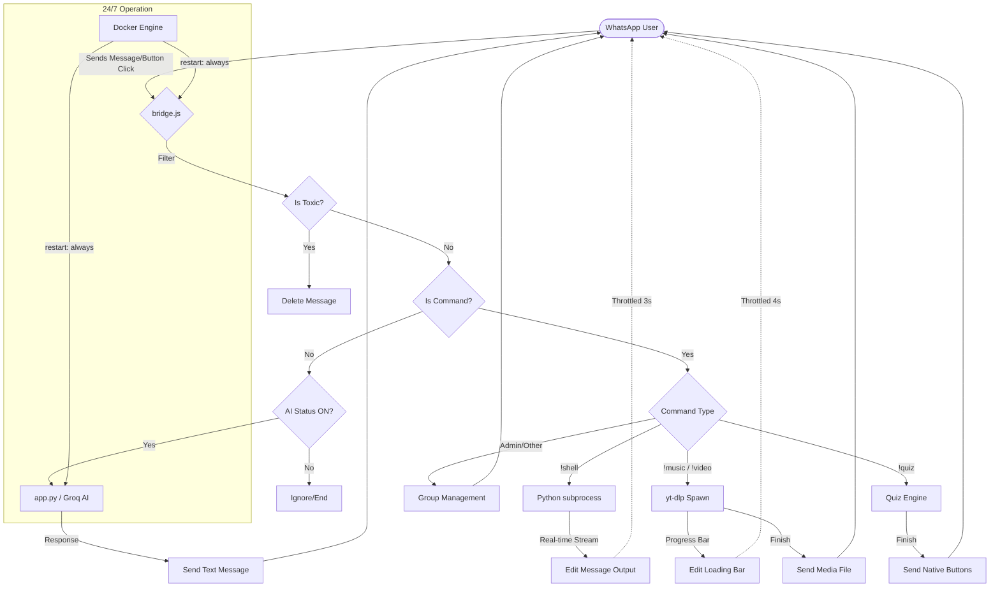

# 🤖 BELINDA_AI

BELINDA_AI is an integrated ecosystem combining a **Flask (Python)** backend and a **Node.js Bridge** to create a powerful, interactive WhatsApp bot. It features AI integration via Groq, educational quizzes, anti-toxic filtering, and automated group management.

---

## 🚀 Key Features
- **AI Brain** (`app.py`): Powered by Flask and Groq API for intelligent conversations.
- **WhatsApp Bridge** (`bridge.js`): High-performance connection using Baileys.
- **Interactive Quiz System**: Automated PG quizzes with native WhatsApp buttons.
- **Anti-Toxic Filter**: Real-time profanity detection and message deletion.
- **Media & System Tools**:
  - **Shell Executor**: Run terminal commands directly from WhatsApp with real-time output updates.
  - **Music Downloader**: Download songs from Spotify (via YouTube search) or YouTube directly as Voice Notes.
  - **Video Downloader**: Download YouTube videos (compressed for WhatsApp).
- **24/7 Availability**: Optimized for Docker deployment on Arch Linux for maximum stability.

---

## 📂 Project Structure
```text
BELINDA_AI/
├── app.py              # Flask server (Logic, AI & Shell Handler)
├── handlers.py         # AI Status, Message & Shell Handlers
├── bridge.js           # WhatsApp Connection Bridge (Baileys)
├── Dockerfile          # Arch Linux based container config
├── docker-compose.yml  # Docker services orchestration
├── requirements.txt    # Python dependencies
├── package.json        # Node.js dependencies
├── .env                # Secret configurations
├── .gitignore          # Git exclusion rules
└── README.md           # Documentation
```

---

## 🏗️ System Architecture & Logic

### Message Processing Flowchart


```mermaid
graph TD
    User([WhatsApp User]) -->|Sends Message/Button Click| Bridge{bridge.js}
    
    %% Filter Logic
    Bridge -->|Filter| Toxic{Is Toxic?}
    Toxic -->|Yes| Delete[Delete Message]
    Toxic -->|No| CmdCheck{Is Command?}

    %% AI Logic
    CmdCheck -->|No| AIStatus{AI Status ON?}
    AIStatus -->|Yes| Flask[app.py / Groq AI]
    Flask -->|Response| SendMsg[Send Text Message]
    SendMsg --> User
    AIStatus -->|No| Ignore[Ignore/End]

    %% Command Logic
    CmdCheck -->|Yes| Dispatcher{Command Type}
    
    Dispatcher -->|!shell| Shell[Python subprocess]
    Shell -->|Real-time Stream| EditShell[Edit Message Output]
    EditShell -.->|Throttled 3s| User

    Dispatcher -->|!music / !video| YTDLP[yt-dlp Spawn]
    YTDLP -->|Progress Bar| EditDL[Edit Loading Bar]
    EditDL -.->|Throttled 4s| User
    YTDLP -->|Finish| SendMedia[Send Media File]
    SendMedia --> User

    Dispatcher -->|!quiz| Quiz[Quiz Engine]
    Quiz -->|Finish| NativeBtn[Send Native Buttons]
    NativeBtn --> User
    
    Dispatcher -->|Admin/Other| Admin[Group Management]
    Admin --> User

    %% Docker Cycle
    subgraph 24/7 Operation
        Docker[Docker Engine] -->|restart: always| Bridge
        Docker -->|restart: always| Flask
    end
```

---

## 💻 System Requirements

* **Docker & Docker Compose**: Recommended for 24/7 operation.
* **Node.js**: `v20.x` or higher (if running locally).
* **Python**: `3.10` or higher (if running locally).
* **FFmpeg**: Required for audio/video conversion.
* **yt-dlp**: Required for media downloading.

---

## 🐳 Running with Docker (Recommended)

The bot is configured to run on **Arch Linux** inside Docker for peak performance.

1. **Build and Start**:
   ```bash
   sudo docker-compose up -d --build
   ```

2. **View Logs (Scan QR Code)**:
   ```bash
   sudo docker-compose logs -f
   ```

3. **Stop Bot**:
   ```bash
   sudo docker-compose down
   ```

---

## ⚙️ Configuration (`.env`)

Create a `.env` file in the root directory:

```env
# Flask Settings
GROQ_API_KEY=gsk_your_api_key_here
FLASK_PORT=8000

# Bridge Settings
PYTHON_URL=http://localhost:8000
SESSION_NAME=auth_info
```

---

## 📝 Change Log (v1.3.0 - March 10, 2026)
- **Arch Linux Base**: Switched Docker base image to Arch Linux for a cutting-edge environment.
- **Native Buttons**: Integrated `@ryuu-reinzz/button-helper` for native interactive WhatsApp buttons in the Quiz system.
- **Shell Format**: Added triple-backtick formatting for `!shell` command outputs.
- **Rate Limit Resilience**: Added safety throttling (3-4s) and try-catch blocks to prevent crashes when WhatsApp hits rate limits.
- **Spotify Search**: Improved Spotify link handling by automatically fetching track metadata for YouTube searches.

---

## 🛠️ Troubleshooting

### ❌ Error: rate-overlimit (429)
* **Cause**: Sending too many messages or edits in a short period.
* **Solution**: The bot now handles this gracefully. If it occurs, the bot will skip the specific update but **won't crash**.

### ❌ Permission Denied (Docker)
* **Cause**: User lacks permission to access `/var/run/docker.sock`.
* **Solution**: Use `sudo` for docker commands or add your user to the `docker` group.

---

*Developed by **Danta** | © 2026 **Studio 234***
