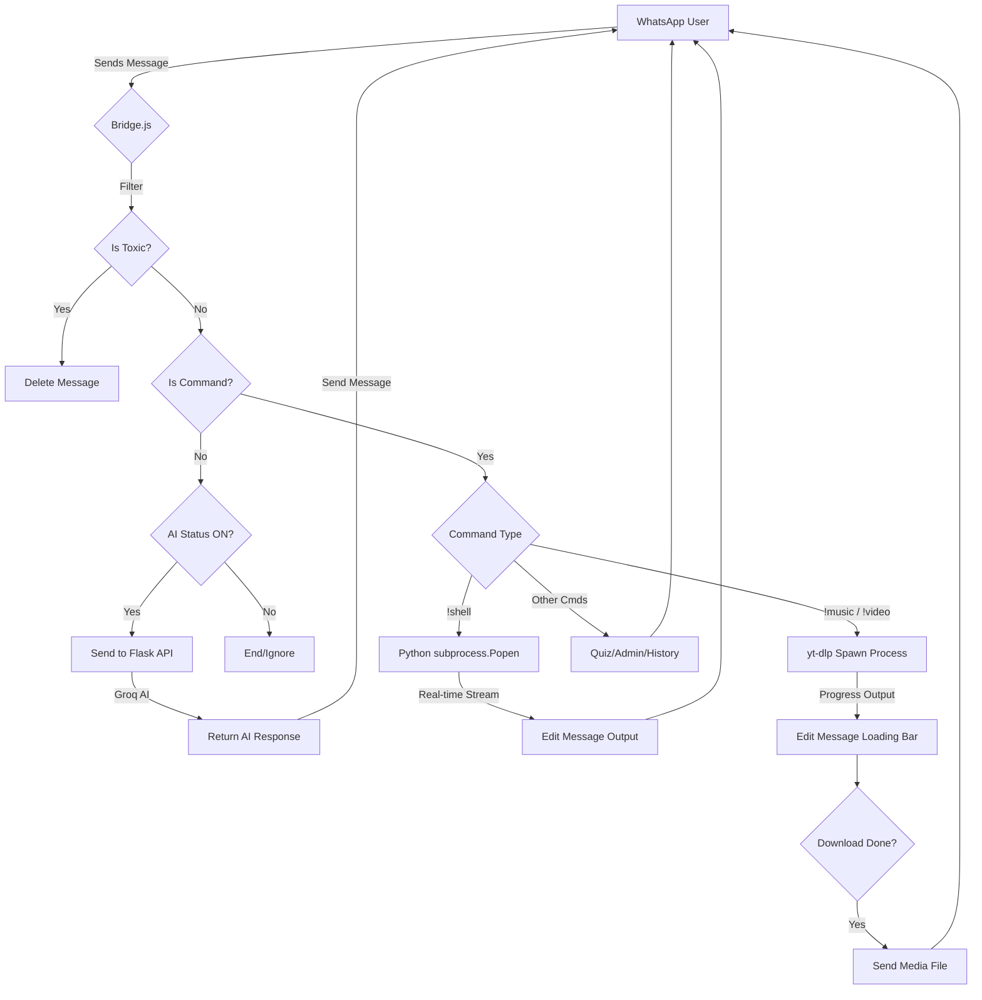

# 🤖 BELINDA_AI

BELINDA_AI is an integrated ecosystem combining a **Flask (Python)** backend and a **Node.js Bridge** to create a powerful, interactive WhatsApp bot. It features AI integration via Groq, educational quizzes, anti-toxic filtering, and automated group management.

---

## 🚀 Key Features
- **AI Brain** (`app.py`): Powered by Flask and Groq API for intelligent conversations.
- **WhatsApp Bridge** (`bridge.js`): High-performance connection using Baileys.
- **Interactive Quiz System**: Automated PG quizzes with discussion features.
- **Anti-Toxic Filter**: Real-time profanity detection and message deletion.
- **Media & System Tools**:
  - **Shell Executor**: Run terminal commands directly from WhatsApp with real-time output updates.
  - **Music Downloader**: Download songs from Spotify (via YouTube search) or YouTube directly as Voice Notes.
  - **Video Downloader**: Download YouTube videos (compressed for WhatsApp).
- **Bot Commands**:
  - `!help` → List all available commands.
  - `!quiz [amount] [subject] [level]` → Start an automated quiz.
  - `!next` → Show question discussion (requires 2 users).
  - `!info` → Check AI & Quiz session status.
  - `!bot` → Toggle AI response ON/OFF.
  - `!reset` → Wipe quiz data for the current group.
  - `!lanjut` → Restart the previous quiz settings.
  - `!selesai` → Terminate the quiz session.
  - `!kick {tag/number}` → Remove a member from the group (admin only).
  - `!add {number}` → Add a new member to the group (admin only).
  - `!open` → Allow all members to send messages in the group (admin only).
  - `!close` → Restrict group chat to admins only (admin only).
  - `!zero` → Clear all stored chat history (admin only).
  - `!shell {command}` → Execute shell command and see real-time output (admin only).
  - `!music {spotify/youtube_url}` → Download and send audio as a Voice Note (PTT).
  - `!video {youtube_url}` → Download and send YouTube video (compressed 480p).
  - `!log` → Show the chat history/logs (available to all members).

---

## 📂 Project Structure
```text
BELINDA_AI/
├── app.py              # Flask server (Logic, AI & Shell Handler)
├── handlers.py         # AI Status, Message & Shell Handlers
├── bridge.js           # WhatsApp Connection Bridge (Baileys)
├── requirements.txt    # Python dependencies
├── package.json        # Node.js dependencies
├── .env                # Secret configurations
├── .gitignore          # Git exclusion rules
└── README.md           # Documentation

```

---

## 💻 System Requirements

To ensure stability and support for media downloads:

* **Node.js**: `v20.x` (LTS) or higher.
* **Python**: `3.10` or higher.
* **FFmpeg**: Required for audio/video conversion.
* **yt-dlp**: Required for media downloading.
* **RAM**: Minimum `512MB` (1GB recommended for media processing).

---

## ⚙️ Configuration (`.env`)

Create a `.env` file in the root directory:

```env
# Flask Settings
GROQ_API_KEY=gsk_your_api_key_here
FLASK_PORT=8000

# Bridge Settings
PYTHON_URL=http://127.0.0.1:8000
SESSION_NAME=auth_info

```

---

## 📝 Change Log (v1.2.0 - March 8, 2026)
- **New Feature: !shell**: Execute terminal commands with real-time output streaming and message editing.
- **New Feature: !music**: Support for Spotify and YouTube music downloads. Spotify links are automatically searched on YouTube. Files are sent as native OGG/Opus Voice Notes for 100% compatibility.
- **New Feature: !video**: Dedicated YouTube video downloader limited to 480p for WhatsApp compatibility.
- **Progress Bars**: Added visual progress bars [▓▓▓░░░] for media downloads using real-time message editing.
- **Stability**: Increased connection timeouts and added robust file detection for downloaded media.

---

## 🏗️ Architecture & Logic Flow

### Message Processing Flowchart


```mermaid
graph TD
    A[WhatsApp User] -->|Sends Message| B{Bridge.js}
    B -->|Filter| C{Is Toxic?}
    C -->|Yes| D[Delete Message]
    C -->|No| E{Is Command?}
    
    E -->|No| G{AI Status ON?}
    G -->|Yes| H[Send to Flask API]
    H -->|Groq AI| I[Return AI Response]
    I -->|Send Message| A
    G -->|No| J[End/Ignore]

    E -->|Yes| K{Command Type}
    
    K -->|!shell| L[Python subprocess.Popen]
    L -->|Real-time Stream| M[Edit Message Output]
    M --> A

    K -->|!music / !video| N[yt-dlp Spawn Process]
    N -->|Progress Output| O[Edit Message Loading Bar]
    O --> P{Download Done?}
    P -->|Yes| Q[Send Media File]
    Q --> A
    
    K -->|Other Cmds| R[Quiz/Admin/History]
    R --> A
```

---

## 🛠️ Troubleshooting

### ❌ Error: Downloaded file not found
* **Cause**: `yt-dlp` might have failed to find the source or the file was deleted before sending.
* **Solution**: Ensure the link is valid and publicly accessible. Check if `ffmpeg` is installed.

### ❌ Error 408 (Timed Out)
* **Cause**: Slow network connection to WhatsApp servers.
* **Solution**: The bridge now has increased timeouts. If it persists, delete `auth_info` and re-scan.

---

*Developed by **Danta** | © 2026 **Studio 234***
