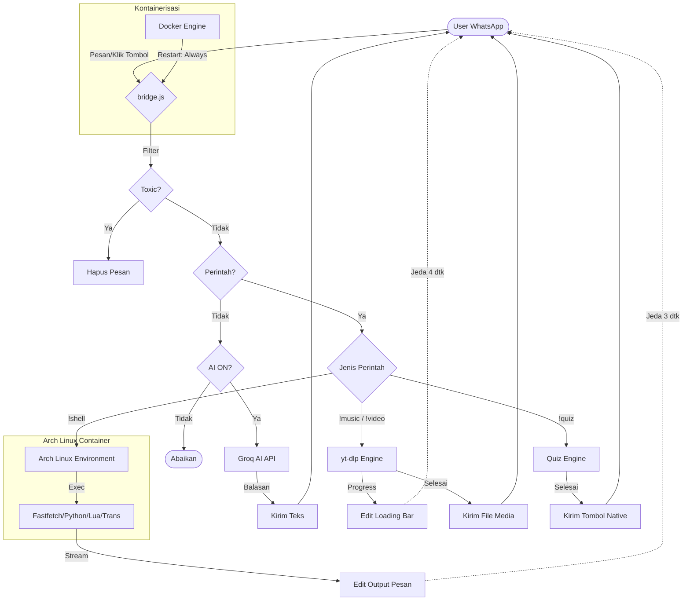

# 🤖 BELINDA_AI

BELINDA_AI adalah asisten cerdas WhatsApp yang menggabungkan **Flask (Python)** dan **Node.js Bridge** dengan integrasi AI dari Groq. Bot ini berjalan di dalam kontainer **Docker berbasis Arch Linux** untuk stabilitas maksimal.

---

## 🚀 Fitur Utama
- **AI Groq**: Percakapan cerdas secara real-time.
- **Shell Executor**: Jalankan perintah terminal via WhatsApp (`!shell`).
- **Dev Tools**: Pre-installed Python, Lua, Fastfetch, dan Translate-shell.
- **Music & Video**: Download lagu (Spotify/YT) dan video YouTube dengan progress bar.
- **Native Buttons**: Tombol interaktif native pada fitur kuis.
- **Anti-Toxic**: Filter kata kasar otomatis.
- **24/7 Ready**: Didesain untuk aktif terus-menerus menggunakan Docker.

---

## 🏗️ Arsitektur & Logika Sistem

### Flowchart Pemrosesan Pesan


```mermaid
graph TD
    User([User WhatsApp]) -->|Pesan/Klik Tombol| Bridge{bridge.js}
    
    %% Filter & Command Check
    Bridge -->|Filter| Toxic{Toxic?}
    Toxic -->|Ya| Delete[Hapus Pesan]
    Toxic -->|Tidak| CmdCheck{Perintah?}

    %% Jalur AI
    CmdCheck -->|Tidak| AIStatus{AI ON?}
    AIStatus -->|Ya| Groq[Groq AI API]
    Groq -->|Balasan| SendText[Kirim Teks]
    SendText --> User
    AIStatus -->|Tidak| End([Abaikan])

    %% Jalur Perintah
    CmdCheck -->|Ya| Type{Jenis Perintah}
    
    Type -->|!shell| Shell[Arch Linux Environment]
    subgraph Arch Linux Container
        Shell -->|Exec| Tools[Fastfetch/Python/Lua/Trans]
    end
    Tools -->|Stream| EditShell[Edit Output Pesan]
    EditShell -.->|Jeda 3 dtk| User

    Type -->|!music / !video| YTDLP[yt-dlp Engine]
    YTDLP -->|Progress| Loading[Edit Loading Bar]
    Loading -.->|Jeda 4 dtk| User
    YTDLP -->|Selesai| Media[Kirim File Media]
    Media --> User

    Type -->|!quiz| Quiz[Quiz Engine]
    Quiz -->|Selesai| Buttons[Kirim Tombol Native]
    Buttons --> User

    %% Docker Restart Logic
    subgraph Kontainerisasi
        Docker[Docker Engine] -->|Restart: Always| Bridge
    end
```

---

## 📂 Struktur Project
```text
BELINDA_AI/
├── app.py              # Backend Python (AI & Shell)
├── bridge.js           # Bridge WhatsApp (Baileys)
├── Dockerfile          # Image Arch Linux (Full Tools)
├── docker-compose.yml  # Konfigurasi Layanan Docker
├── .env                # API Key & Konfigurasi
└── README.md           # Dokumentasi
```

---

## 🐳 Cara Menjalankan (Docker Lokal)

Pastikan Docker sudah terinstal di laptop Arch Linux Anda.

1.  **Persiapan**: Buat file `.env` dan masukkan `GROQ_API_KEY` Anda.
2.  **Membangun & Menjalankan**:
    ```bash
    sudo docker-compose up -d --build
    ```
3.  **Scan QR Code**:
    Lihat log untuk menscan QR menggunakan WhatsApp di HP:
    ```bash
    sudo docker-compose logs -f
    ```
4.  **Mematikan Bot**:
    ```bash
    sudo docker-compose down
    ```

---

## 🛠️ Troubleshooting

- **Error Rate Limit (429)**: Jika muncul saat edit pesan (shell/download), bot akan otomatis menjeda pembaruan tanpa crash.
- **Permission Denied**: Selalu gunakan `sudo` saat menjalankan perintah `docker-compose` di Arch Linux jika user Anda belum masuk grup docker.

---

*Developed by **Danta** | © 2026 **Studio 234***
