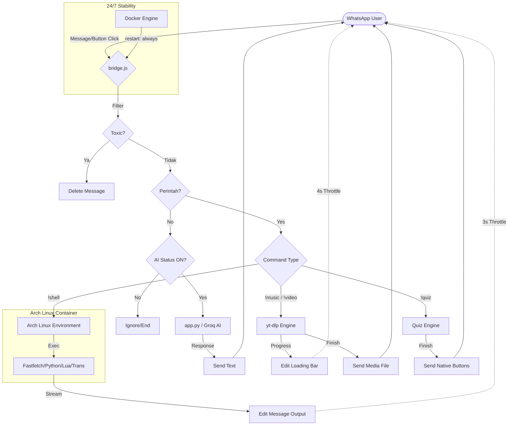

# 🤖 BELINDA_AI - Advanced WhatsApp Assistant

<p align="center">
  
</p>

<p align="center">
  <a href="https://github.com/Danta23/Belinda_AI">
    
  </a>
  <a href="https://www.docker.com/">
    
  </a>
  <a href="#">
    
  </a>
  <a href="LICENSE">
    
  </a>
</p>

<p align="center">
  
</p>

<p align="center">
  <b>BELINDA_AI</b> is a high-performance, integrated ecosystem combining a <b>Flask (Python)</b> backend and a <b>Node.js Bridge</b> powered by <b>Baileys</b>. Designed for speed, reliability, and ultimate cross-platform control.
</p>

<p align="center">
  
  
  
</p>

---

## 🌟 Key Features

### 🧠 Intelligence & Conversation
- **Groq AI Integration**: Lightning-fast, intelligent conversations using Llama 3 models.
- **Flexible AI Mode**: Switch per user between cloud AI and a local Ollama model using `!mode cloud` or `!mode local`.
- **Voice Note Support**: Send Voice Notes to the bot to get transcribed AI-generated replies when AI mode is ON.
- **Context Awareness**: Remembers recent chat history for more natural responses.
- **Smart AI Defaults**: AI starts automatically for direct contacts and stays off by default in groups; admins can toggle it per chat using `!bot`.

### 💻 System & Developer Tools
- **Real-time Shell Executor**: Execute terminal commands directly from WhatsApp.
- **Streaming Output**: Watch command results stream line-by-line with message editing.
- **Full Arch Linux Environment**: Pre-installed `Python`, `Lua`, `Fastfetch`, `Translate-shell`, and essential CLI tools.

### 🎵 Multimedia Processing
- **Music Downloader**: Supports **Spotify** (auto-search) and **YouTube**.
- **Voice Note Delivery**: Media is sent as native OGG/Opus PTT for 100% playback compatibility.
- **Video Downloader**: YouTube video downloads limited to 480p for WhatsApp size optimization.
- **Progress Bars**: Real-time visual loading bars `[▓▓▓░░░]` for all downloads.

### 🛡️ Management & Security
- **Anti-Toxic Filter**: Real-time detection and deletion of profanity.
- **Native Interactive Buttons**: Modern WhatsApp buttons for Quiz navigation (`!lanjut`/`!selesai`).
- **Rate Limit Resilience**: Advanced throttling (3-4s) to prevent WhatsApp bans/crashes.

---

## 🏗️ System Architecture


```mermaid
graph TD
    User([WhatsApp User]) -->|Message/Button Click| Bridge{bridge.js}
    
    %% Filter & Command Check
    Bridge -->|Filter| Toxic{Toxic?}
    Toxic -->|Ya| Delete[Delete Message]
    Toxic -->|Tidak| CmdCheck{Perintah?}

    %% AI Path
    CmdCheck -->|No| AIStatus{AI Status ON?}
    AIStatus -->|Yes| Flask[app.py / Groq AI]
    Flask -->|Response| SendText[Send Text]
    SendText --> User
    AIStatus -->|No| Ignore[Ignore/End]

    %% Command Path
    CmdCheck -->|Yes| Type{Command Type}
    
    Type -->|!shell| Shell[Arch Linux Environment]
    subgraph Arch Linux Container
        Shell -->|Exec| Tools[Fastfetch/Python/Lua/Trans]
    end
    Tools -->|Stream| EditShell[Edit Message Output]
    EditShell -.->|3s Throttle| User

    Type -->|!music / !video| YTDLP[yt-dlp Engine]
    YTDLP -->|Progress| Loading[Edit Loading Bar]
    Loading -.->|4s Throttle| User
    YTDLP -->|Finish| Media[Send Media File]
    Media --> User

    Type -->|!quiz| Quiz[Quiz Engine]
    Quiz -->|Finish| Buttons[Send Native Buttons]
    Buttons --> User

    %% Docker Cycle
    subgraph 24/7 Stability
        Docker[Docker Engine] -->|restart: always| Bridge
    end
```

---

## 📂 Project Structure

Comprehensive file map for cross-platform support:

```text
BELINDA_AI/
├── app.py                  # Python API & Shell Logic (Flask)
├── handlers.py             # AI logic, Status management, and Shell stream handlers
├── bridge.js               # WhatsApp Connection, Command Dispatcher & Buttons
├── Dockerfile              # Arch Linux based container build configuration
├── docker-compose.yml      # Service orchestration & Volume management
├── requirements.txt        # Python backend library dependencies
├── package.json            # Node.js bridge library dependencies
├── .env.example            # Environment variables configuration template
│
├── 🐧 Linux (Bash/Zsh) Scripts
│   ├── start.sh            # Bootstraps both Flask and Node.js
│   ├── stop.sh             # Safely terminates all bot processes
│   └── reset.sh            # Clears session data and history
│
├── 🐟 Linux (Fish Shell) Scripts
│   ├── start.fish          # Bootstraps using Fish-idiomatic syntax
│   ├── stop.fish           # Process termination for Fish users
│   └── reset.fish          # Environment reset for Fish users
│
├── 🪟 Windows 11 (PowerShell) Scripts
│   ├── start.ps1           # Bootstraps bot in Windows environment
│   ├── stop.ps1            # Force-kills Python/Node tasks
│   └── reset.ps1           # Clears auth_info and logs on Windows
│
├── 🍎 macOS (Darwin) Scripts
│   ├── start_mac.sh        # Optimized for Zsh/Bash on macOS
│   ├── stop_mac.sh         # Process management for Mac users
│   └── reset_mac.sh        # Session cleanup for Mac users
│
├── 📱 Android (Termux) Scripts
│   ├── start_termux.sh     # Bootstraps with Termux-specific paths
│   ├── stop_termux.sh      # Process management for Mobile users
│   └── reset_termux.sh     # Mobile session and log cleanup
│
└── README.md               # Professional Project Documentation
```

---

## 📦 Native Desktop & Mobile Applications

For a more user-friendly experience, we provide native installers that include an **auto-cloning system**. Upon first launch, the app will automatically detect or clone the latest `Belinda_AI` repository to ensure you have the full AI ecosystem ready.

### 📥 Downloads (GitHub Releases)
- **🪟 Windows 11**: `Belinda-AI-Installer.exe` (Portable Executable)
- **🐧 Arch Linux (AUR)**: Install via `yay -S belinda-ai` or `paru -S belinda-ai`
- **🍎 macOS**: `Belinda-AI.dmg` (Intel/Apple Silicon)
- **📱 Android**: `Belinda-AI.apk`

### 🛠️ Developer Build Instructions
If you want to build the native apps yourself:

**Windows (.exe)**:
```powershell
./build_windows.ps1
```
**Arch Linux (AUR)**:
```bash
makepkg -si
```

---

## ⚙️ Configuration (`.env`)

Create a `.env` file in the root directory.

### `.env.example`
```env
# --- Flask Backend Settings ---
GROQ_API_KEY=gsk_your_api_key_here
FLASK_PORT=8000

# --- Bridge Settings ---
# Use http://localhost:8000 for Docker, http://127.0.0.1:8000 for Local
PYTHON_URL=http://localhost:8000
SESSION_NAME=auth_info
OLLAMA_URL=http://127.0.0.1:11434
OLLAMA_MODEL=llama3.2
OLLAMA_TIMEOUT_MS=120000

# --- Connection Tuning ---
BRIDGE_HOST=127.0.0.1
BRIDGE_PORT=9000
```

### 🧠 AI Modes and Smart Defaults

Belinda separates the **AI on/off state** from the **response provider**:

| Setting | Purpose | Default |
| :--- | :--- | :--- |
| `!bot` | Enables or disables AI replies for the current chat | Contact: ON, Group: OFF |
| `!mode cloud` | Uses the existing Groq/cloud response provider | Default provider |
| `!mode local` | Uses the configured local Ollama model | Selected per user |
| `!mode` | Shows your currently selected provider | — |
| `!info` | Shows chat type, AI state, and provider | — |

Direct contacts receive AI replies automatically. Group AI remains disabled until a group admin runs `!bot`, preventing unwanted replies in active groups. A manual `!bot` change remains active for that chat while the backend is running.

Provider selection is saved per user in `ai_modes.json`. Changing to local mode does not affect other users.

#### Using Ollama (`!mode local`)

1. Install [Ollama](https://ollama.com/).
2. Download the configured model:
   ```bash
   ollama pull llama3.2
   ```
3. Ensure Ollama is running:
   ```bash
   ollama serve
   ```
4. Set `OLLAMA_URL` and `OLLAMA_MODEL` in `.env`, then restart Belinda.
5. Send `!mode local` and check the result with `!info`.

`!mode local` currently applies to text conversations. Voice transcription and other backend-powered tools continue to use the cloud backend.

> **Docker note:** `127.0.0.1` inside a container refers to the container itself. Set `OLLAMA_URL` to an address reachable from the container, such as `http://host.docker.internal:11434` where supported.

### 🔎 AI Startup and Debug Logs

At startup, the bridge reports:

- `CLOUD_READY` or `CLOUD_UNAVAILABLE`
- `OLLAMA_READY`, `OLLAMA_UNAVAILABLE`, or `OLLAMA_MODEL_MISSING`
- Active Ollama URL/model and the smart contact/group defaults

Each text AI request logs a request ID, provider mode, duration, and input/output size. Message contents are intentionally excluded from these logs.

Check backend readiness directly:

```bash
curl http://127.0.0.1:8001/health
```

A healthy response has HTTP status `200` and contains `"status": "ok"`.

---

## 🚀 Deployment Methods

### 🥇 Recommended: Docker (Cross-Platform)
Using Docker is the **highly recommended** method. It ensures you have the full Arch Linux environment, all media codecs, and 24/7 stability regardless of your host OS.

1.  **Install Docker & Docker Compose**.
2.  **Start the bot**:
    ```bash
    sudo docker-compose up -d --build
    ```
3.  **Scan QR Code**:
    ```bash
    sudo docker-compose logs -f
    ```

---

### 🥈 Alternative: Local Installation (Manual)

If you cannot use Docker, follow the guide for your specific OS. Ensure **FFmpeg** and **yt-dlp** are installed on your system path.

#### 📦 Environment Setup & Dependencies Installation
Before starting the bot, you must create a virtual environment, activate it, and install all required packages.

**🐧 Arch Linux**
- **Bash/Zsh**:
  ```bash
  python -m venv .venv
  source .venv/bin/activate
  pip install -r requirements.txt
  npm install
  ```
- **Fish Shell**:
  ```fish
  python -m venv .venv
  source .venv/bin/activate.fish
  pip install -r requirements.txt
  npm install
  ```

**🪟 Windows 11**
```powershell
python -m venv .venv
.\.venv\Scripts\Activate.ps1
pip install -r requirements.txt
npm install
```

**🍎 macOS**
```bash
python -m venv .venv
source .venv/bin/activate
pip install -r requirements.txt
npm install
```

**📱 Android (Termux)**
```bash
python -m venv .venv
source .venv/bin/activate
pip install -r requirements.txt
npm install
```

#### 🐧 Linux (Arch/Ubuntu/Debian)
- **Bash/Zsh**: `chmod +x start.sh && ./start.sh`
- **Fish Shell**: `chmod +x start.fish && ./start.fish`

#### 🪟 Windows 11
1. Open PowerShell as Administrator.
2. Run: `Set-ExecutionPolicy RemoteSigned -Scope CurrentUser` (once).
3. Start: `.\start.ps1`

#### 🍎 macOS (Intel/Apple Silicon)
1. Install Homebrew and dependencies: `brew install node python ffmpeg yt-dlp`
2. Start: `chmod +x start_mac.sh && ./start_mac.sh`

#### 📱 Android (Termux)
1. Install Termux from F-Droid.
2. Setup: `pkg update && pkg install nodejs python ffmpeg git tur-repo && pkg install yt-dlp`
3. Start: `chmod +x start_termux.sh && ./start_termux.sh`

---

## 📜 Command Reference

| Command | Description | Access |
| :--- | :--- | :--- |
| `!help` | Display interactive menu | All |
| `!info` | Show chat type, AI state, and response provider | All |
| `!bot` | Enable or disable AI replies for the current chat | Admin in groups |
| `!mode {local\|cloud}` | Select Ollama or cloud responses per user | All |
| `!anti {type}` | Setup Protection (toxic/link/spam) | Admin |
| `!game` | Play 17 interactive text games | All |
| `!sholat {city}`| Get local prayer times | All |
| `!afk {reason}` | Set away from keyboard status | All |
| `!rules` | Show group rules from description| All |
| `!font {text}` | Convert to aesthetic fonts | All |
| `!top` | View top 10 active members | Admin |
| `!absen` | List all group members | Admin |
| `!list {mode} {name}` | Manage custom lists | Admin |
| `!limit {num}` | Set AI usage limit (min 35/inf) | Admin |
| `!cari {query}`| Search information on internet | All |
| `!image {url}` | Download image from link | All |
| `!quiz` | Start a trivia quiz | All |
| `!music {url}` | Download Spotify/YouTube to VN | All |
| `!video {url}` | Download YouTube Video (480p) | All |
| `!quran {s:a}` | Get Ayah (e.g., !quran 1:1) | All |
| `!gen doc:{fmt}`| AI Documents (ppt, word, excel) | All |
| `!gen scr:{ext}`| Generate Script (py, js, etc) | All |
| `!gen 3dm:{ext}`| AI Generate/Search 3D Models | All |
| `!shell {cmd}` | Run Linux commands (real-time) | Admin |
| `!kick {all\|@user}` / `!add` | Member Management / Kick all | Admin |
| `!open` / `!close`| Group permission control | Admin |
| `!zero` | Wipe chat context memory | Admin |
| `!log` | View recent chat logs | All |


---

## 📝 Maintenance & Logs

### Change Log (v1.4.0) — August 4, 2026
- **Flexible AI Providers**: Added per-user `!mode local` and `!mode cloud` selection with cloud mode as the default.
- **Local Ollama Support**: Added configurable Ollama URL, model, timeout, and conversation context for text responses.
- **Smart Chat Defaults**: AI now starts ON for direct contacts and remains OFF by default in groups.
- **Improved Status UX**: `!info` displays the detected chat type, AI state, and selected response provider.
- **Persistent Preferences**: User provider choices are saved in `ai_modes.json` across bot restarts.
- **Startup Diagnostics**: Added cloud/Ollama readiness checks, missing-model guidance, request IDs, response timing, and privacy-safe logs.
- **Backend Health Check**: Added the `GET /health` endpoint for deployment monitoring and troubleshooting.
- **Documentation & Website**: Added setup guides, troubleshooting details, responsive feature pages, and an AI command reference.

### Change Log (v1.3.0)
- **Full OS Support**: Native scripts for Windows, Mac, Linux (Bash/Fish), and Android.
- **Arch Docker Integration**: Container now mirrors a full Arch Linux distro.
- **Interactive UI**: Switched quiz results to native WhatsApp buttons.
- **Safety**: Robust rate-limit protection and error handling.

### Troubleshooting
- **Missing File Error**: Ensure `ffmpeg` is installed. In Docker, this is automatic.
- **QR Code not appearing**: Check logs via `docker-compose logs -f`.
- **429 Rate Limit**: Wait a few seconds; the bot will resume automatically.
- **`CLOUD_UNAVAILABLE`**: Confirm the Flask backend is running and `PYTHON_URL` is correct.
- **`OLLAMA_UNAVAILABLE`**: Start Ollama and verify `OLLAMA_URL`.
- **`OLLAMA_MODEL_MISSING`**: Run `ollama pull <OLLAMA_MODEL>` using the model configured in `.env`.
- **No AI replies in a group**: A group admin must run `!bot`; group AI is off by default.

---

## 📄 License

This project is licensed under the **MIT License**. See the [LICENSE](LICENSE) file for more details.

---

*Developed with ❤️ by **Danta** | © 2026 **Studio 234***
